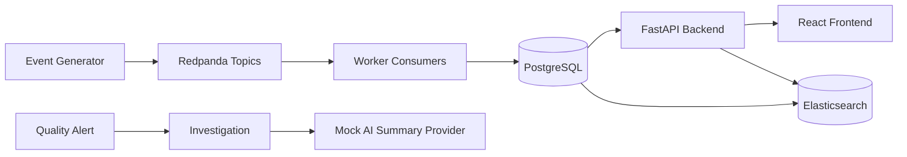

# Manufacturing Quality Intelligence Platform

A full-stack manufacturing quality intelligence platform that simulates factory station events, equipment sensor readings, vehicle quality defects, rule-based quality alerts, investigation workflows, Elasticsearch search, and AI-assisted investigation summaries.

This is a portfolio simulation, not a production factory integration. It is designed to show manufacturing quality data engineering, event-driven ingestion, internal tooling, API design, search, testing, CI, and Dockerized local development.

## Project Overview

The platform models a realistic internal quality workflow:

1. Seed a manufacturing plant with production lines, stations, equipment, and vehicles.
2. Generate station events, sensor readings, inspection results, and defects.
3. Publish events to Redpanda Kafka-compatible topics.
4. Run a Python worker that consumes events, persists data, and applies quality rules.
5. Create quality alerts when defect spikes or abnormal readings are detected.
6. Expose manufacturing records through a FastAPI backend.
7. Display operational data in a React dashboard.
8. Search historical defects, alerts, investigations, and event summaries with Elasticsearch.
9. Create investigations from alerts.
10. Generate evidence-grounded AI investigation summaries with a local mock provider.

## Why This Project Matters

Manufacturing quality teams need more than raw defect records. They need a way to connect station activity, equipment readings, vehicle context, alerts, investigations, and historical search into one operational workflow.

This project demonstrates how to build that kind of platform as a data product:

- event-driven ingestion for factory signals;
- durable PostgreSQL records for manufacturing state;
- deterministic rules for explainable quality alerts;
- search for investigation history;
- frontend workflows for quality engineers;
- mock AI assistance constrained to real evidence;
- tests, Docker Compose, and CI for repeatable engineering practice.

## Tesla / Manufacturing Quality Role Alignment

This project maps directly to manufacturing quality and factory data platform work:

- Manufacturing quality data engineering.
- Full-stack internal tools for engineers and operators.
- Factory data platform thinking.
- Event-driven ingestion.
- Data modeling for plants, lines, stations, equipment, vehicles, defects, alerts, and investigations.
- API design with FastAPI and typed schemas.
- React dashboard development for operational workflows.
- Search workflows for quality investigations.
- Testing strategy across backend, worker, event generator, frontend, and E2E.
- GitHub Actions CI.
- Dockerized local development.
- AI-assisted engineering workflows with explicit limitations.

## Architecture

Text architecture:

```text
event-generator
   |
   v
Redpanda topics
   |
   v
worker consumers
   |
   v
PostgreSQL <---- FastAPI backend ----> React frontend
   |
   v
Elasticsearch search index

Investigation workflow:
QualityAlert -> Investigation -> AI Summary
```

Mermaid architecture:



The FastAPI backend lives in `backend/`. This project does not use an `api/` folder.

## Tech Stack

Frontend:

- React
- TypeScript
- Vite
- TanStack Query
- React Router
- Vitest
- React Testing Library
- Playwright

Backend:

- Python
- FastAPI
- Pydantic
- SQLAlchemy
- Alembic
- Pytest

Data:

- PostgreSQL
- Elasticsearch

Streaming:

- Redpanda / Kafka-compatible topics

Worker:

- Python consumer service
- Rule engine
- Event persistence

DevOps:

- Docker Compose
- GitHub Actions CI
- Makefile

## Feature Walkthrough

1. Seed manufacturing plant, production lines, stations, equipment, and vehicles.
2. Generate station and sensor events.
3. Publish events to Redpanda.
4. Worker consumes and persists events.
5. Rule engine detects defect spikes and abnormal readings.
6. Quality alerts are created.
7. Frontend dashboard shows defects and alerts.
8. Engineers create investigations from alerts.
9. Elasticsearch supports historical search.
10. Mock AI provider generates evidence-grounded investigation summaries.

## Repository Structure

```text
backend/              FastAPI application, SQLAlchemy models, Alembic migrations, backend tests
worker/               Python Redpanda/Kafka consumer and rule engine
event-generator/      Simulated manufacturing event generator
frontend/             React, TypeScript, and Vite application
e2e/                  Playwright end-to-end workflow tests
docs/                 Architecture, phase notes, testing docs, and interview guide
.github/workflows/    GitHub Actions CI
docker-compose.yml    Local platform services
Makefile              Local developer and demo commands
```

## Local Setup

Prerequisites:

- Python 3.12+
- Node.js 20+
- Docker Desktop
- Make, or separate PowerShell terminals for the fallback commands

Fresh clone:

```powershell
git clone REPLACE_WITH_REPO_URL
cd manufacturing-quality-intelligence-platform
copy .env.example .env
docker compose config
```

Install local dependencies if running without Docker:

```powershell
cd backend
pip install -e .
```

```powershell
cd worker
pip install -e .
```

```powershell
cd event-generator
pip install -e .
```

```powershell
cd frontend
npm install
```

## One-Command Demo

```powershell
make demo
```

This starts infrastructure, runs migrations, seeds the database, creates Redpanda topics, produces defect-spike demo events, and starts backend, worker, and frontend services.

Open:

- Frontend: http://localhost:5173
- Backend docs: http://localhost:8000/docs
- Redpanda Console: http://localhost:8080
- Elasticsearch: http://localhost:9200

Reset local Docker data:

```powershell
make reset
```

`make reset` deletes local Docker volumes, including PostgreSQL demo data.

## PowerShell Manual Setup

Use this path if Make is not installed on Windows.

Start infrastructure:

```powershell
docker compose up postgres redpanda redpanda-console elasticsearch
```

Backend terminal:

```powershell
cd backend
pip install -e .
alembic upgrade head
python -m app.db.seed
python -m uvicorn app.main:app --reload --port 8000
```

Create Redpanda topics:

```powershell
docker compose exec redpanda rpk topic create station.events sensor.readings quality.defects quality.alerts investigation.events
docker compose exec redpanda rpk topic list
```

Worker terminal:

```powershell
cd worker
pip install -e .
python -m app.main
```

Event generator terminal:

```powershell
cd event-generator
pip install -e .
python -m app.main --mode defect-spike --publish --broker localhost:19092
```

Frontend terminal:

```powershell
cd frontend
npm install
npm run dev
```

## Testing

Local commands:

```powershell
docker compose config
docker compose --profile tools config
```

```powershell
cd backend
pytest
```

```powershell
cd worker
pytest
```

```powershell
cd event-generator
pytest
```

```powershell
cd frontend
npm run test:run
npm run build
```

E2E tests require running backend and frontend services:

```powershell
cd e2e
npm install
npx playwright install
npx playwright test
```

Makefile shortcuts:

```powershell
make test
make test-e2e
```

GitHub Actions CI validates Docker Compose, backend tests, worker tests, event-generator tests, frontend tests, and frontend build.

CI badge placeholder to update after pushing to GitHub:

```markdown

```

## Demo Scenario

1. Start the stack with `make demo`.
2. Confirm database seed data exists.
3. Produce defect-spike events.
4. Let the worker generate a quality alert.
5. Open the dashboard.
6. Open the alert queue.
7. Open an alert detail page.
8. Create an investigation.
9. Generate an AI summary.
10. Search for `torque`.
11. Resolve the investigation.
12. Run the automated tests.

## Screenshots or Screenshot Placeholders

Screenshots can be added after running the local demo. Do not treat these as implemented image assets yet.

Suggested screenshots:

- Dashboard
- Alerts Queue
- Alert Detail
- Investigation Detail
- AI Summary Panel
- Search Page
- Redpanda Console topics
- GitHub Actions CI run

## API Examples

Health:

```powershell
curl http://localhost:8000/health
```

Vehicles:

```powershell
curl http://localhost:8000/api/v1/vehicles
```

Alerts:

```powershell
curl http://localhost:8000/api/v1/alerts
```

Create an investigation from an alert:

```powershell
curl -X POST http://localhost:8000/api/v1/alerts/REPLACE_WITH_ALERT_ID/investigation `
  -H "Content-Type: application/json" `
  -d "{\"title\":\"Investigate torque alert\",\"summary\":\"Opened from quality alert\",\"status\":\"active\"}"
```

Generate an AI summary:

```powershell
curl -X POST http://localhost:8000/api/v1/investigations/REPLACE_WITH_INVESTIGATION_ID/ai-summary
```

Search:

```powershell
curl "http://localhost:8000/api/v1/search?q=torque"
```

## Event Examples

Station event:

```json
{
  "event_id": "4c9f6b85-73dc-4b7a-90c8-2b9c9f16f101",
  "event_type": "station_event",
  "occurred_at": "2026-01-01T12:00:00Z",
  "payload": {
    "vehicle_vin": "MQPLANT0000000001",
    "station_code": "A-FINAL",
    "status": "entered"
  }
}
```

Sensor reading:

```json
{
  "event_id": "2f7bd493-9d65-496c-bb2a-45c2beffcc21",
  "event_type": "sensor_reading",
  "occurred_at": "2026-01-01T12:01:00Z",
  "payload": {
    "equipment_asset_tag": "EQ-A-TORQUE-02",
    "station_code": "A-BODY",
    "metric_name": "torque_nm",
    "value": 52.4,
    "unit": "Nm",
    "upper_limit": 45.0
  }
}
```

Defect event:

```json
{
  "event_id": "c973a279-7158-4558-b520-8fbda87a9999",
  "event_type": "defect_detected",
  "occurred_at": "2026-01-01T12:02:00Z",
  "payload": {
    "vehicle_vin": "MQPLANT0000000001",
    "station_code": "A-BODY",
    "equipment_asset_tag": "EQ-A-TORQUE-02",
    "defect_code": "TORQUE_OUT_OF_SPEC",
    "severity": "high",
    "description": "Door fastener torque above upper limit"
  }
}
```

Quality alert event:

```json
{
  "alert_code": "DEFECT_CODE_SPIKE",
  "station_id": 1,
  "equipment_id": 2,
  "severity": "critical",
  "title": "Defect spike detected",
  "description": "Repeated torque defects detected at the same station.",
  "evidence_json": {
    "defect_code": "TORQUE_OUT_OF_SPEC",
    "count": 3,
    "window_minutes": 60
  },
  "status": "open"
}
```

## Search Examples

Rebuild search indexes:

```powershell
make reindex-search
```

Search all groups:

```powershell
curl "http://localhost:8000/api/v1/search?q=torque"
```

Search alerts:

```powershell
curl "http://localhost:8000/api/v1/search/alerts?q=torque"
```

Search investigations:

```powershell
curl "http://localhost:8000/api/v1/search/investigations?q=root"
```

## AI Summary Example

This is generated by the local mock provider and uses only available evidence.

```json
{
  "likely_issue": "Available evidence may indicate a torque quality issue at the affected station.",
  "affected_station": "A-BODY",
  "affected_equipment": "EQ-A-TORQUE-02",
  "evidence": [
    "Quality alert reported repeated torque defects.",
    "Alert evidence included readings above the configured upper limit.",
    "Investigation notes mentioned possible tool calibration drift."
  ],
  "recommended_next_checks": [
    "Verify torque tool calibration records.",
    "Inspect recent sensor readings for the same equipment.",
    "Review vehicles processed during the same time window."
  ],
  "confidence": "medium",
  "limitations": [
    "Summary is generated from available platform evidence only.",
    "No real external LLM is used in local mock mode."
  ]
}
```

## System Design Notes

- PostgreSQL is the system of record.
- Elasticsearch is a derived search index.
- Redpanda carries event streams between producer and worker.
- FastAPI handles request/response APIs.
- The worker handles long-running event consumption and rule execution.
- The frontend uses TanStack Query for server state.
- E2E tests use API-created fixtures for stability.
- The AI summary provider defaults to mock mode to avoid paid APIs and hallucinated claims.

## What I Would Improve Next

- Authentication and role-based access control.
- Real Kafka deployment profiles.
- Richer event schemas.
- Better Elasticsearch mappings.
- Observability with OpenTelemetry.
- Production-grade alert deduplication.
- Historical trend analytics.
- Model/provider abstraction for real LLMs.
- More robust E2E fixtures.
- Kubernetes deployment.

## Known Limitations

- This is a portfolio simulation, not connected to real factory systems.
- Security and authentication are intentionally minimal.
- The AI provider defaults to mock mode.
- The event generator uses simulated manufacturing data.
- Production deployment would require stronger observability, authentication, secrets management, and monitoring.
- Screenshots are not committed yet; add them after running the local demo.
- E2E tests require backend and frontend services to be running.

## Resume Bullet Examples

- Built a full-stack Manufacturing Quality Intelligence Platform using FastAPI, React, PostgreSQL, Redpanda, Elasticsearch, and Docker Compose to simulate factory quality event ingestion, alerting, investigation, and search workflows.
- Implemented event-driven ingestion pipeline with Kafka-compatible Redpanda topics, Python worker consumers, SQLAlchemy persistence, and rule-based quality alert generation for simulated station, sensor, and defect events.
- Designed investigation workflow with evidence-based alerts, Elasticsearch search, and mock AI-assisted root-cause summaries constrained to real event data and documented limitations.
- Added automated backend, worker, event-generator, frontend, E2E, and GitHub Actions CI tests to demonstrate production-oriented engineering practices.

## Interview Talking Points

- Why the worker is separate from the API.
- Why PostgreSQL is the source of truth and Elasticsearch is a derived index.
- How Redpanda supports event-driven ingestion.
- How idempotency prevents duplicate event persistence.
- How alert rules stay deterministic and explainable.
- How the AI summary provider avoids unsupported claims.
- How Docker Compose makes the project easy to demo.
- How GitHub Actions maps to local test commands.
- What would be required for production security, observability, and deployment.

More detail is available in `docs/interview-guide.md`.

## Documentation Map

- `docs/architecture.md`
- `docs/testing-strategy.md`
- `docs/interview-guide.md`
- `docs/phase16.md`
- `docs/api-contracts.md`
- `docs/event-contracts.md`
- `docs/data-model.md`
- `docs/youtube-tutorial-notes.md`
